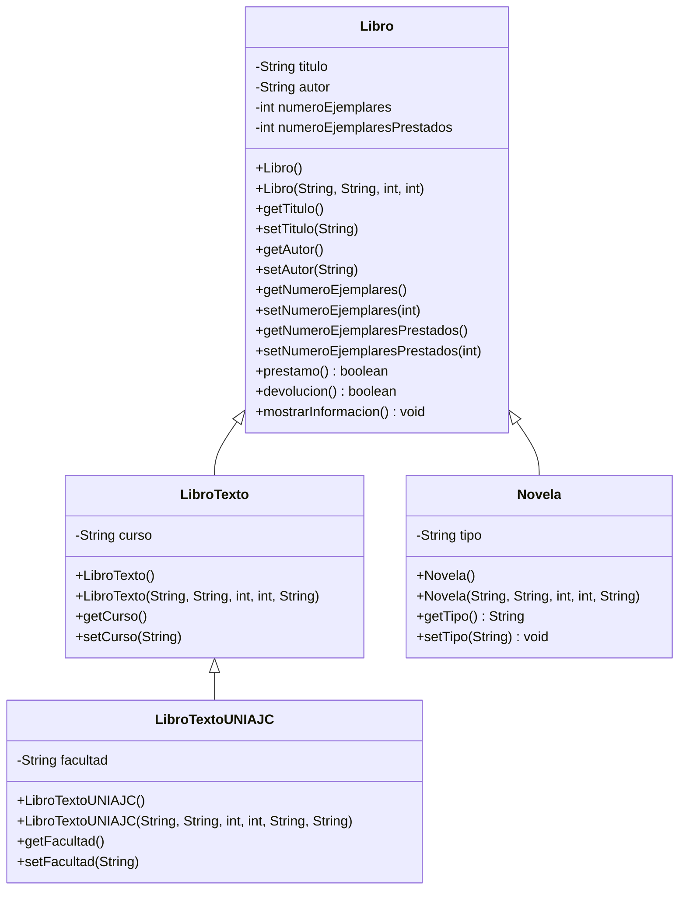
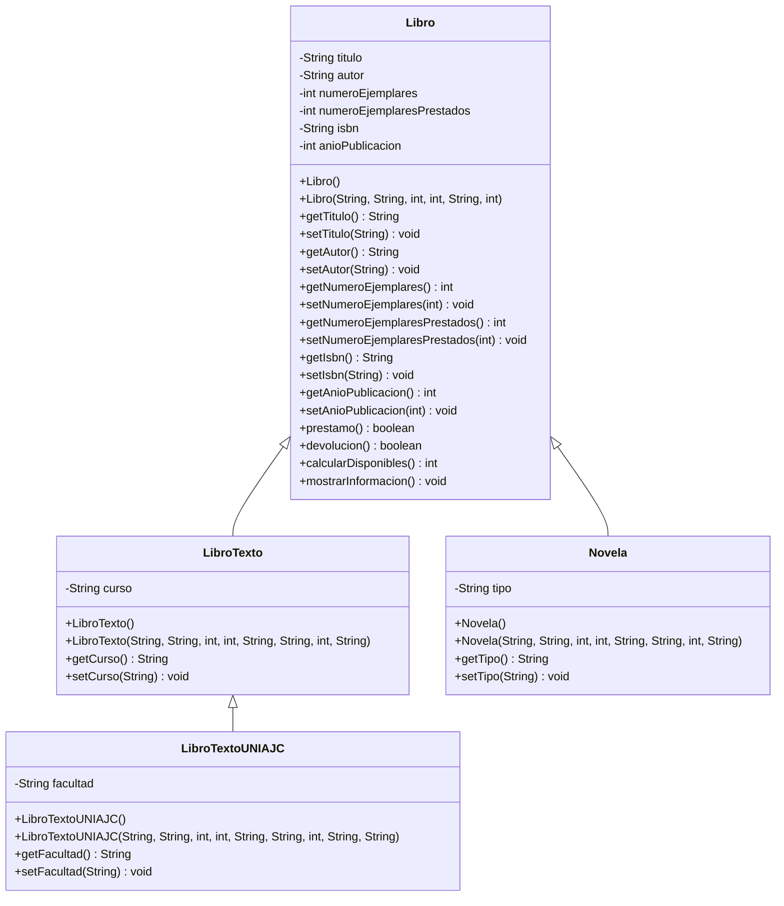

# PARCIAL 1 PROGRAMACION
- Lauren Sofia Valderrama 
- Eva Maria Diaz

## Diagrama de Clases


---
## 1. Situaciones donde NO se podria realizar la herencia
### 1. Modificador de acceso `private` en atributos

```java
public class Libro {
    private String titulo;
    private String autor;
    private int numeroEjemplares;
    private int numeroEjemplaresPrestados;
    
    // Sin getters ni setters
}

public class LibroTexto extends Libro {
    public void mostrarDatos() {
        System.out.println(titulo); //ERROR: titulo tiene acceso privado
    }
}
```
#### Explicacion: Actualmente el código funciona porque usa métodos `get/set` públicos y `super()` en los constructores. **Si elimináramos esos métodos de acceso**, las clases hijas no podrían leer ni modificar los atributos de la clase padre, ya que `private` solo permite acceso dentro de la propia clase. La herencia se vuelve inútil para manipular los datos.

### 2. Clase declarada como `final`

```java
public final class Libro { // Palabra clave "final"
    // atributos y métodos
}

public class LibroTexto extends Libro { } // ERROR: no se puede heredar
```
#### Explicacion: En Java, una clase marcada con `final` **no puede tener ninguna subclase**. Si se agregara `final` a la declaración de `Libro`, toda la jerarquía (`LibroTexto`, `Novela`, `LibroTextoUNIAJC`) dejaría de compilarse, ya que no se permite extenderla.

## 2. Nuevos atributos y metodo adicional
### Atributos propuestos

| Atributo          | Tipo      | Descripción                                                      |
|:-----------------:|:---------:|:----------------------------------------------------------------:|
| `isbn`            | `String`  | Código internacional único que identifica cada edición del libro |
| `anioPublicacion` | `int`     | Año en que fue publicado el libro                                |

#### Ambos se agregan en la clase Libro, por lo que todas las subclases los heredan automáticamente.

### Metodo adicional
```java
/**
 * Calcula la cantidad de ejemplares disponibles para préstamo
 * @return ejemplares totales menos ejemplares prestados
 */
public int calcularDisponibles() {
    return numeroEjemplares - numeroEjemplaresPrestados;
}
```

#### Por qué tiene sentido: Es un cálculo que se repite en el uso del sistema; al implementarlo en la clase base, todas las subclases (`LibroTexto`, `Novela`, etc.) lo pueden usar sin reescribirlo.

### Diagrama de Clases con los agregados

