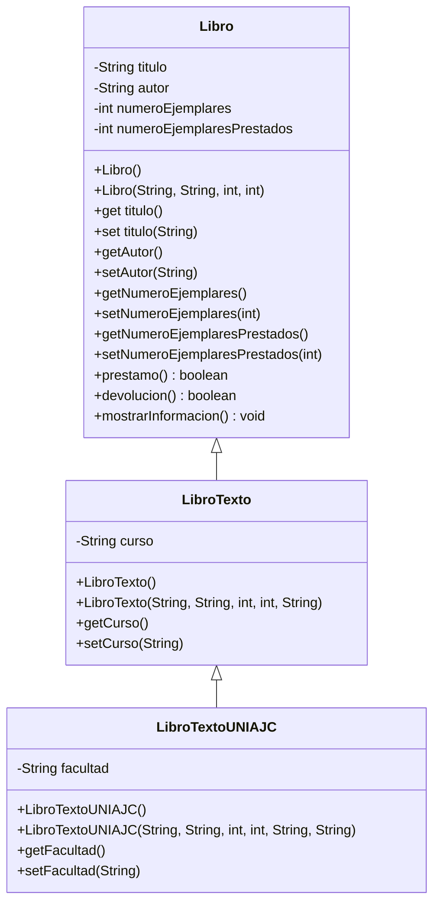

# PARCIAL 1 PROGRAMACION
- Lauren Sofia Valderrama 
- Eva Maria Diaz

## Diagrama de Clases

```mermaid
classDiagram
    class Libro {
        -String titulo
        -String autor
        -int numeroEjemplares
        -int numeroEjemplaresPrestados
        +Libro()
        +Libro(String, String, int, int)
        +get titulo()
        +set titulo(String)
        +getAutor()
        +setAutor(String)
        +getNumeroEjemplares()
        +setNumeroEjemplares(int)
        +getNumeroEjemplaresPrestados()
        +setNumeroEjemplaresPrestados(int)
        +prestamo() boolean
        +devolucion() boolean
        +mostrarInformacion() void
    }

    class LibroTexto {
        -String curso
        +LibroTexto()
        +LibroTexto(String, String, int, int, String)
        +getCurso()
        +setCurso(String)
    }

    class LibroTextoUNIAJC {
        -String facultad
        +LibroTextoUNIAJC()
        +LibroTextoUNIAJC(String, String, int, int, String, String)
        +getFacultad()
        +setFacultad(String)
    }

    Libro <|-- LibroTexto
    LibroTexto <|-- LibroTextoUNIAJC
```
